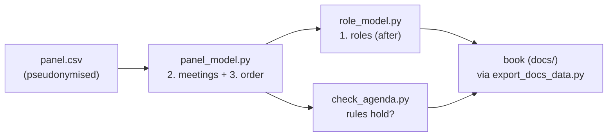

# Models for fair review-panel meetings

This folder holds the optimisation models behind the book in `docs/`, and the scripts that run
them. This README describes them on their own, so the code can be reviewed without the book.

## The problem

The review panel of the Icelandic Technology Development Fund (TÞS) meets about once a week during
a funding round. Each proposal is discussed once, by three panel members: an **editor** and two
**readers**. A member must attend every meeting where one of their proposals is on the agenda, and
may leave once the last of them has been discussed. Until then they sit through the proposals of
others: unpaid time, which this project calls **waiting**.

How proposals are spread over meetings, and the order within each meeting, decide how often each
member has to attend and how long they wait. The models make that fair. They are inspired by the
*Anesthetist's Peel Assignment Problem* (APAP,
[IDeLM-APAP](https://github.com/HI-IDN/IDeLM-APAP)), where a daily order decides which
anaesthetist goes home first. A meeting here plays the role of a day there, and a funding round
the role of a week.

Three decisions are involved:

1. **Who reviews which proposal**, and in which role (editor, reader 1 who speaks second, reader 2
   who speaks last).
2. **Which meeting** each proposal is discussed in.
3. **The order** within each meeting.



The reviewers of each proposal are taken as given (the staff's assignment). The schedule only
depends on *which three* members review a proposal, not on who of them is editor, so roles are
chosen afterwards. `role_model.py --mode assign` can also choose the reviewers themselves, for the
what-if of chapter 7 of the book.

## Data

`../data/tdf/panel.csv` is the only data in the repository. It is pseudonymised: members are codes
`R01`–`R21`, proposals `A001`–…, meetings `M1`–`M9` in date order, all assigned in random order.
One row per proposal:

| Column | Meaning |
|---|---|
| `application` | proposal code |
| `meeting` | meeting in the staff's current plan (empty: not yet placed) |
| `coi` | members with a conflict of interest, separated by `;` |
| `editor`, `reader1`, `reader2` | the three reviewers |
| `position` | slot on the agenda, for meetings that have already been held |
| `readers_alphabetical`, `readers_missing` | data-quality flags from the extraction |

`../data/tdf/members.csv` (`member`, `new`) marks new members. It stays local (gitignored), like
everything else in `data/tdf/` except `panel.csv`. Real names never enter the code or the data.

## The schedule model (`models/panel_model.py`)

A mixed-integer program, solved with Gurobi.

**Decision variables**

| Variable | Meaning |
|---|---|
| `x[p, m, k]` | proposal *p* is discussed in meeting *m* as number *k* |
| `a[r, m]` | member *r* attends meeting *m* |
| `leave[r, m]` | slot after which *r* may leave *m* (the slot of their last proposal; 0 if absent) |
| `z` | the largest burden of any member (for the fairness step) |

Variables exist only where they can be nonzero: a proposal of a held meeting has only its known
slot, a meeting has only as many slots as proposals that may go there, and `a`, `leave` exist only
for meetings a member can have a proposal in. Meetings a member cannot attend are left out of the
sets rather than forbidden by constraints.

**Measures**, per member over the round:

* *waiting* = slots sat through minus own proposals = proposals of others sat through;
* *meetings* = meetings attended;
* *burden* = α × meetings + waiting. α (in slots) says how much one meeting attended weighs against
  waiting; the chosen value is α = 2. α can differ per member (`--alpha-file`, a CSV of member,
  alpha): a member who would rather attend less often and stay longer gets a higher α. Own proposals are paid work and are not counted, so this is
  the *unpaid* burden. Burden carried over from earlier rounds (`--carry`, a CSV of member, burden)
  is added to it in the fairness steps.

The output recomputes every measure from the agenda (`member_measures` in `panel_model.py`), not
from the model variables, so it shows what the plan actually does.

**Rules (constraints)**

| Rule | Hard or soft |
|---|---|
| Each proposal is discussed once; one proposal per slot; no gaps in an agenda | hard |
| Held meetings stay exactly as they were | hard |
| Nothing is added to the next, announced meeting (`--next-meeting M3`); its proposals may be postponed at a cost | hard / cost `postpone_penalty` |
| In the first meeting everyone attends with exactly one proposal (when it is still open) | hard |
| A member has at most `max_per_member` = 5 own proposals in a meeting not yet held | hard |
| … and preferably at most `soft_max_per_member` = 4 | cost `soft_max_weight` per extra proposal |
| Own proposals per meeting close to a target (3.5 experienced, 2.5 new) | cost `target_weight` |
| A member with a conflict of interest has left before that proposal comes up | cost `coi_penalty` each time not |
| Optional rotation (`--rotate-wait`): the members of the last proposal of a meeting leave early at the next meeting, or (`-1`) skip it | hard, experimental |

**Objective.** `--fairness` selects it. The recommended one is solved in steps, each holding what
the steps before reached (`lexburden`):

1. **Fewest meetings attended**, with the own proposals per meeting close to the targets and the
   costs above (conflicts, postponements, soft cap).
2. **The smallest largest burden**: minimise `z` with α × meetings + waiting ≤ `z` for every
   member. Members who attend often thus wait less, and nobody else waits more than necessary.
3. **The least total waiting**, with a tiny reward for new members waiting early in the round,
   when they sit longer to learn anyway. "Early" ends at `new_editor_from` in `panel_model.yml`
   (M5), the same meeting from which `--new-editor-from` lets new members be editor: they are
   only readers until then.

Step 2 protects only the member with the largest burden; everyone below it is left to step 3, which
favours whoever is quickest to serve, and that is how the original model came to make frequent
attenders wait more. `--fairness leximin` therefore replaces step 2 by a series (Ogryczak's ordered
min-max): the smallest largest burden, then the smallest sum of the two largest, and so on, for
`leximin_levels` steps. The default, 3, is a truncated leximin: it fixes the three largest
burdens in turn and leaves the rest to step 3, to keep runs short; 0 fixes every member's, at the
cost of one more solve per member. On small test instances this never gave a
worse burden vector than `lexburden`, often a better one at the same total waiting, and fewer pairs
where the member who attends more also waits more.

Two further options apply to all the step modes:

* `--meetings-slack s` holds step 1 at its value plus *s* instead of exactly. Step 1 otherwise
  treats a meeting attended as worth any amount of waiting, so α never gets to trade a meeting for
  α slots of waiting; a slack of one or two lets the later steps do that.
* `--no-worse-than <agenda.csv>` adds two first steps. Step −1 minimises the rule penalties alone:
  a conflicted member present (one who still has an own proposal later in the meeting, so would
  have to step out and come back in) and postponed proposals. Step 0 then makes the total excess
  of each member's burden over their burden in a reference plan (e.g. the staff's meetings,
  scenario `current`) as small as possible: zero when nobody needs to be worse off. The log lists
  anyone who still is. The rules come first because step 0 is held from then on and would
  otherwise buy less burden with conflicts. A warm start from the reference plan (`--start`)
  gives step 0 a solution with no excess wherever that plan keeps the rules. The comparison is of
  this round only; `--carry` does not enter it.

Each step is held with a small tolerance (10⁻⁴, relative), since Gurobi accepts binaries within
10⁻⁵ of 0 or 1 and a tighter hold can make the next step infeasible. Step 1 is held as one weighted
sum of meetings and rule costs, so later steps may trade between those terms (one more meeting
for one fewer conflicted member present, say); with a reference plan, step −1 already holds the
rule costs, so only meetings and targets can move.

The time limit is split 40 % for step 1 (with a reference plan, 10 % for step −1 and 20 % for
step 0) and the rest equally over the other steps. Other modes
are kept for comparison: `lexsum` (steps 1 and 3 only: the plan with least total waiting, to show
the price of fairness), `lexmax` (step 2 on waiting alone), `lex` and `lexboth` (APAP-style equity
bands on waiting per meeting), and the single-objective `proposal` (the book's original: least
burden per proposal for the worst-off member), `total`, `unpaid`, `bands` and `sum`.

**Solving.** Open meetings with the same candidate proposals are interchangeable, so symmetry is
broken by ordering them by their first proposal (off when meeting order matters, e.g. rotation).
A member with *j* own proposals in a meeting cannot leave before slot *j*, which strengthens the
bounds. `--start` warm-starts from an earlier agenda (reordered to respect the symmetry rule).
Even so, the gap is rarely closed within an hour for the scenarios that move proposals between
meetings: the solutions are the best found, not proven optimal. Splitting the problem in two
(meetings first, then the order within each meeting, like one APAP day) is the next step.

**Output** (`--out <prefix>`): `<prefix>_agenda.csv` (meeting, position, application),
`<prefix>_members.csv` (per member: proposals, meetings, slots, waiting, burden, carry),
`<prefix>_fairness.csv` (largest and mean burden, Gini coefficient, all burdens largest first,
total waiting and meetings, the rank correlation of meetings and waiting, which is positive when
frequent attenders also wait more, and the number of such pairs), `<prefix>_levels.csv` (per
step the held value, and the solver's objective, bound and gap: with large gaps, a later step only improves on an earlier step's best
found solution, not its optimum) and
`<prefix>_coi_present.csv`. The log prints the value and bound of each step.

## The role model (`models/role_model.py`)

Given an agenda, chooses for each proposal who of its three reviewers is editor and who is
reader 1 (`--mode roles`), or all three reviewers and the editor (`--mode assign`).

* **Pay** is a base fee plus 23 000 ISK per editor role and 15 000 ISK per reader role. In `roles`
  mode the spread of pay among experienced members is minimised, per proposal by default.
  Waiting is unpaid, and `--pay-per` can reward it with editor roles: per slot sat through
  (`presence`), per proposal plus waiting above the regression curve of waiting on meetings
  (`fit`), pay per proposal plus the unpaid burden above the mean burden (`burden`, recommended with
  the stepwise schedule, since it uses the schedule's own measure; pass the schedule's `--alpha` or
  `--alpha-file` here too if it was run with them), or pay per proposal rising in
  proportion to how far a member's waiting per proposal is above the mean (`mean`: 50 % above the
  mean, 50 % more per proposal). `mean` pays members who wait long because they attend rarely,
  which the stepwise schedule intends, so it partly undoes the schedule; and with the 2/3 editor
  cap pay per proposal can rise by only about 25-30 %. New members don't count towards either mean.
* **Limits**: nobody is editor on more than 2/3 of their proposals (`max_editor_share`); new
  members are editor on at most 15 % of their proposals (`new_editor_share`); in `assign` mode
  they are not editor before the midpoint of their own proposals (in time order), and at most two new members review a
  proposal. In `roles` mode the staff chose the three, so the midpoint rule does not apply.
* **Settled roles** are kept: held meetings always, and announced ones with `--keep-roles M3`.
* **Room in the discussion**: the editor takes 3 parts, reader 1 2 and reader 2 1; with a smaller
  weight, the spread of room per proposal over members is kept small.

Output: `<prefix>_panel.csv`, in the format of `panel.csv`, so it can be scheduled in turn.

## Checking (`models/check_agenda.py`)

Checks an agenda against the rules of its scenario, independently of the model: held meetings as
they were, closed meetings as planned, nothing added to the next meeting, per-member limits.
With `--keep-meetings` it checks that no proposal left its planned meeting, and with
`--first-meeting-rule` that everyone has exactly one proposal in the first meeting; `--unavailable`
and `--new-editor-from` (alone, the meeting `new_editor_from` in the settings) check unavailable meetings and proposals edited by new members coming up too
early (held meetings excepted). It also prints,
without counting them as problems, the conflicted members present and the fairness measures of
the agenda. `run_panel_scenarios.sh` runs it after every schedule.

## Exact order within meetings (`models/order_meetings.py`)

Keeps every proposal of an agenda in its meeting and orders each meeting not yet held exactly, by
dynamic programming over the set of proposals already discussed (at most 2¹⁵ states; about a second
for a whole round). Per meeting it finds the fewest conflicted members present and then the least
total waiting, with nobody staying longer than in the given agenda, so no burden goes up; and,
as a lower bound, the least total waiting with nothing held. It writes the reordered
`<prefix>_agenda.csv` and `<prefix>_order.csv` (per meeting: conflicted present and waiting, given
and best, and the bound). It calls no solver; it reuses the readers and measures of `panel_model.py`.

```bash
python -m models.order_meetings ../data/tdf/panel.csv ../data/tdf/results/free_agenda.csv \
  --out ../data/tdf/results/free_ordered
```

On the book's agendas of the single-objective model (`../docs/data/`), the order was already best
or within 1–2 % of best given the meetings (`free` 513 → 508 waiting, `scratch` 477 → 470,
`current` and `free_max4` unchanged): the solver's gap lies almost wholly in the choice of
meetings and the fairness steps, not in the order.

## Running

Requires Python 3.10+ with `requirements.txt` and a Gurobi licence (an academic licence is free;
the pip wheel's trial licence is too small). From `code/`:

```bash
bash run_panel_scenarios.sh            # all scenarios, results in ../data/tdf/results/
python export_docs_data.py             # pseudonymised copies the book reads (../docs/data/)
```

`run_panel_scenarios.sh` takes environment variables: `RESULTS` (results folder), `MODEL_OPTIONS`
(extra options for every schedule run) and `ONLY` (scenario names to run). The final runs of
1 October 2026 used

```bash
RESULTS=../data/tdf/results/final \
MODEL_OPTIONS="--fairness lexburden --alpha 2 --postpone-penalty 3" bash run_panel_scenarios.sh
```

| Scenario | What is free |
|---|---|
| `current` | the staff's meetings; only the order within each meeting |
| `free` | the next meeting (M3) is announced; later meetings are re-planned |
| `free_sum` | as `free`, without the fairness step (least total waiting, for comparison) |
| `free_leximin` | as `free`, with `--fairness leximin` (the three largest burdens, `leximin_levels`) |
| `free_noworse` | as `free_leximin`, and nobody worse off than in `current` where possible |
| `free_max4` | as `free`, at most 4 own proposals per meeting |
| `scratch` | the whole round from the start, nothing fixed |
| `roles`, `roles_presence`, `roles_presence_free` | roles on the staff's meetings or on `free` |
| `assign`, `assign_schedule` | reviewers chosen from scratch, then meetings and order for them |

Each schedule starts from the solution of the one before (`--start`). Gurobi logs are written next
to the results and are never committed (they contain licence details).

## Settings (`models/panel_model.yml`)

Read by both models and shown as a table in the book; command-line options override them.

| Setting | Value | Meaning |
|---|---|---|
| `alpha` | 2 | cost of attending a meeting, in slots (chosen from an experiment with 0–4) |
| `alpha_file` | none | CSV (member, alpha) of α per member, overriding `alpha` |
| `max_per_meeting` | 15 | most proposals in a meeting |
| `max_per_member` / `soft_max_per_member` | 5 / 4 | hard limit and soft cap on own proposals in a meeting |
| `soft_max_weight` | 0.5 | cost per proposal above the soft cap |
| `coi_penalty` | 1 | cost each time a conflicted member is present |
| `postpone_penalty` | 0.5 (final runs: 3) | cost of postponing an announced proposal |
| `target_experienced` / `target_new` | 3.5 / 2.5 | target own proposals per meeting |
| `new_editor_share`, `max_editor_share`, `max_new_per_proposal` | 0.15, 2/3, 2 | role limits |
| `time_limit` | 600 s | default time limit |
| `meetings_slack` | 0 | slack on the meetings step (step modes) |
| `leximin_levels` | 3 | largest burdens fixed in turn with `--fairness leximin` (0: all) |

`run_experiments.py` collects parameter experiments in a local SQLite file
(`../data/tdf/experiments/`).
