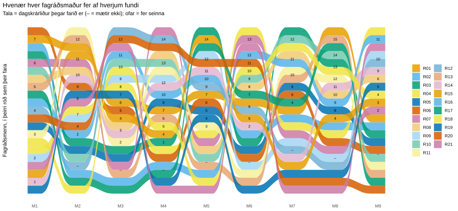

<!-- Two new slides for glaerur.qmd (the slides thread merges them). Data: scenario 2, docs/data/s2_*; roles from panel.csv. -->

## Hver fær hvað?

{fig-alt="Sankey-mynd: hvenær hver fagráðsmaður fer af hverjum fundi í sviðsmynd 2"}

::: {.blue-note}
Hvert band er einn fagráðsmaður (kóði), hver súla fundur. Talan er dagskrárliðurinn þegar hann fer af fundinum, ofar þýðir að hann fer seinna og – að hann mætir ekki.
:::

## Ritstjóri eða lesari?

::: {.two-col}
::: {.soft .blue}
<h3>Hlutverkin</h3>
Ritstjórar eru frá 1 til 11 á mann (miðgildi 5) og lesarahlutverk frá 4 til 18 (miðgildi 11). Hlutfall ritstjórahlutverka er frá 5 % til 73 % hjá hverjum fagráðsmanni.
:::
::: {.soft .yellow}
<h3>Greiðslur</h3>
Grunngjald 38.000 kr. + 23.000 kr. fyrir hvert ritstjórahlutverk + 15.000 kr. fyrir hvert lesarahlutverk. Greiðslur eru frá 181.000 kr. til 432.000 kr. (miðgildi 331.000 kr.), samtals 6.628.000 kr.
:::
:::

::: {.blue-note}
Hlutverkin skiptast ójafnt: þeir sem eru oftar ritstjórar fá meira, óháð biðinni. Þess vegna mælum við með að bestun hlutverkanna sé næsta skref.
:::
